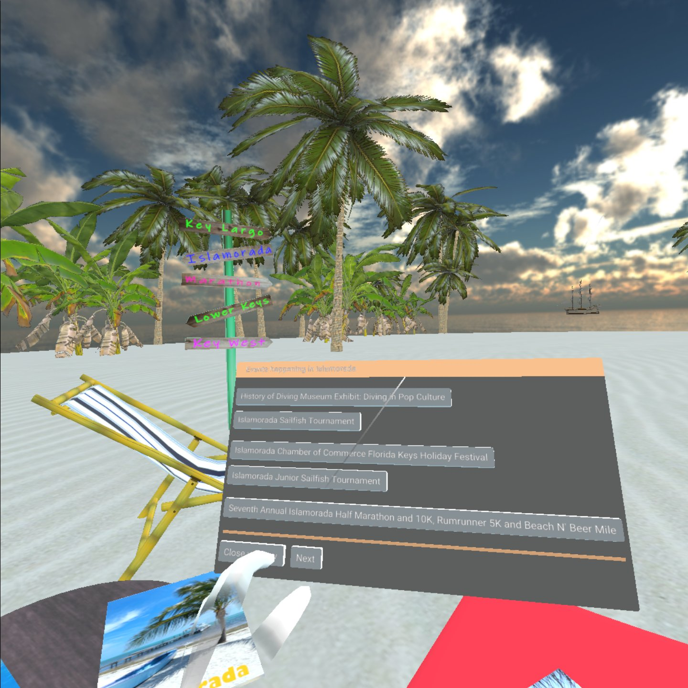

### **ConchRepublicVR-StereoKit**

This is a Virtual Reality project, using the StereoKit toolkit (https://stereokit.net/)

 **Conch Republic VR**  targets the *Oculus Quest2*, using OpenXR and StereoKit's functionality to place the user in a serene (Florida Keys) oriented beach setting.

**.GLB models** are used that have animations, along with music and other effects.

A core part of the application provides users the capability of 'picking up' interactive brochures, where they can manipulate their postions in 3D space using StereoKits UI capabilities. 
A button on each brochure facilitates calls to a method that loads up to date Florida Keys events calendar details for the selected Florida Key location into a StereoKit UI Window.

When the application starts, a thread is launched to make an external API request to download up-to-date 
JSON details for all events. To simplify the code, the call is done once at launch to fetch all events for all keys
during a period that the user is shown a 'splash' logo.

All assets in the app (Sounds, Music, Photos, Images, and Models) are freely available, with 
links are provided in the included **'Attributions.txt'** file

